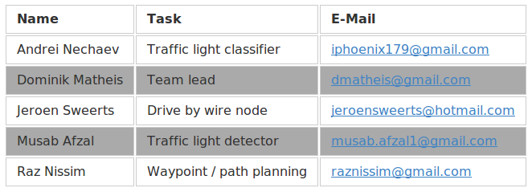

# Capstone Project of Udacity's Self-Driving Car Nanodegree Program

This is the project repository of Team "Carla's little helpers" for the final project of the Udacity Self-Driving Car Nanodegree: Programming a Real Self-Driving Car. For more information about the project, see the project introduction [here](https://classroom.udacity.com/nanodegrees/nd013/parts/6047fe34-d93c-4f50-8336-b70ef10cb4b2/modules/e1a23b06-329a-4684-a717-ad476f0d8dff/lessons/462c933d-9f24-42d3-8bdc-a08a5fc866e4/concepts/5ab4b122-83e6-436d-850f-9f4d26627fd9).

## Team

The team "Carla's little helpers" consists of the following members (listed in alphabetical order):



## Project Goal

Goal of the project is the implementation of different ROS (Robot Operating System) nodes to make a self-driving car (a test vehicle equipped with different sensors) drive around a track without human interaction/input. Before testing with the real test car will the software implementation be tested in an virtual environment using a  simulator software which was also used during the ROS node development. The ROS nodes are implemented in Python and based on a given bare-bone project structure provided by Udacity.

## Implementation Approach

We basically followed the the suggestions provided by Udacity for the final project and implemented all required nodes independently from each other (different git forks) and merged all ready (locally tested) parts in a joint master repository. Each team member was responsible for specific modules (or nodes) of the project, which were distributed by an elective process.

* Implementation of a basic waypoint node (publishing list of final waypoints)
* Parallel implementation of DBW, traffic light nodes
 * Drive by wire module - DBW (translation of waypoint / path to vehicle commands)
 * Traffic light detection (traffic light phase and position detection)
* Waypoint updater finalization (updating waypoints dependent on results of traffic light nodes)
* Obstacle detection (e.g. pedestrians or vehicles) was not part of this project (but it would be similar to the traffic light detection)

As reference how the different ROS nodes communicate you can have a look into the following diagram provided by Udacity:


### Project hints

#### Implementation

During the development time we were facing some performance issues (especially while testing all vision related nodes: camera activation in the simulator). For this reason we were following some suggestions from Udacity's forum and reduced the logging frequency of ROS nodes as well as the processing frequency of the waypoint follower constexpr int LOOP_RATE = 10). This might be changed before testing it in the real test vehicle to maintain smooth vehicle maneuvering. Generally it is recommended to develop and test the project on systems with dedicated NVIDIA GPU(s) (laptops could be not sufficient, except for gaming laptops!).

#### Organization

Beside a private slack channel and e-mail communications github was the most used tool. Especially the easy to use software version management function helped a lot to implement, test and merge ROS nodes in an international team with different time zones. Also a small Wiki was established to gather findings and useful links during the project: [Wiki](https://github.com/mathdo/Capstone/wiki)

## Udacity installation instructions
### Native Installation

* Be sure that your workstation is running Ubuntu 16.04 Xenial Xerus or Ubuntu 14.04 Trusty Tahir. [Ubuntu downloads can be found here](https://www.ubuntu.com/download/desktop).
* If using a Virtual Machine to install Ubuntu, use the following configuration as minimum:
  * 2 CPU
  * 2 GB system memory
  * 25 GB of free hard drive space

  The Udacity provided virtual machine has ROS and Dataspeed DBW already installed, so you can skip the next two steps if you are using this.

* Follow these instructions to install ROS
  * [ROS Kinetic](http://wiki.ros.org/kinetic/Installation/Ubuntu) if you have Ubuntu 16.04.
  * [ROS Indigo](http://wiki.ros.org/indigo/Installation/Ubuntu) if you have Ubuntu 14.04.
* [Dataspeed DBW](https://bitbucket.org/DataspeedInc/dbw_mkz_ros)
  * Use this option to install the SDK on a workstation that already has ROS installed: [One Line SDK Install (binary)](https://bitbucket.org/DataspeedInc/dbw_mkz_ros/src/81e63fcc335d7b64139d7482017d6a97b405e250/ROS_SETUP.md?fileviewer=file-view-default)
* Download the [Udacity Simulator](https://github.com/udacity/CarND-Capstone/releases).

### Docker Installation
[Install Docker](https://docs.docker.com/engine/installation/)

Build the docker container
```bash
docker build . -t capstone
```

Run the docker file
```bash
docker run -p 4567:4567 -v $PWD:/capstone -v /tmp/log:/root/.ros/ --rm -it capstone
```

### Usage

1. Clone the project repository
```bash
git clone https://github.com/udacity/CarND-Capstone.git
```

2. Install python dependencies
```bash
cd CarND-Capstone
pip install -r requirements.txt
```
3. Make and run styx
```bash
cd ros
catkin_make
source devel/setup.sh
roslaunch launch/styx.launch
```
4. Run the simulator

### Real world testing
1. Download [training bag](https://drive.google.com/file/d/0B2_h37bMVw3iYkdJTlRSUlJIamM/view?usp=sharing) that was recorded on the Udacity self-driving car (a bag demonstraing the correct predictions in autonomous mode can be found [here](https://drive.google.com/open?id=0B2_h37bMVw3iT0ZEdlF4N01QbHc))
2. Unzip the file
```bash
unzip traffic_light_bag_files.zip
```
3. Play the bag file
```bash
rosbag play -l traffic_light_bag_files/loop_with_traffic_light.bag
```
4. Launch your project in site mode
```bash
cd CarND-Capstone/ros
roslaunch launch/site.launch
```
5. Confirm that traffic light detection works on real life images
